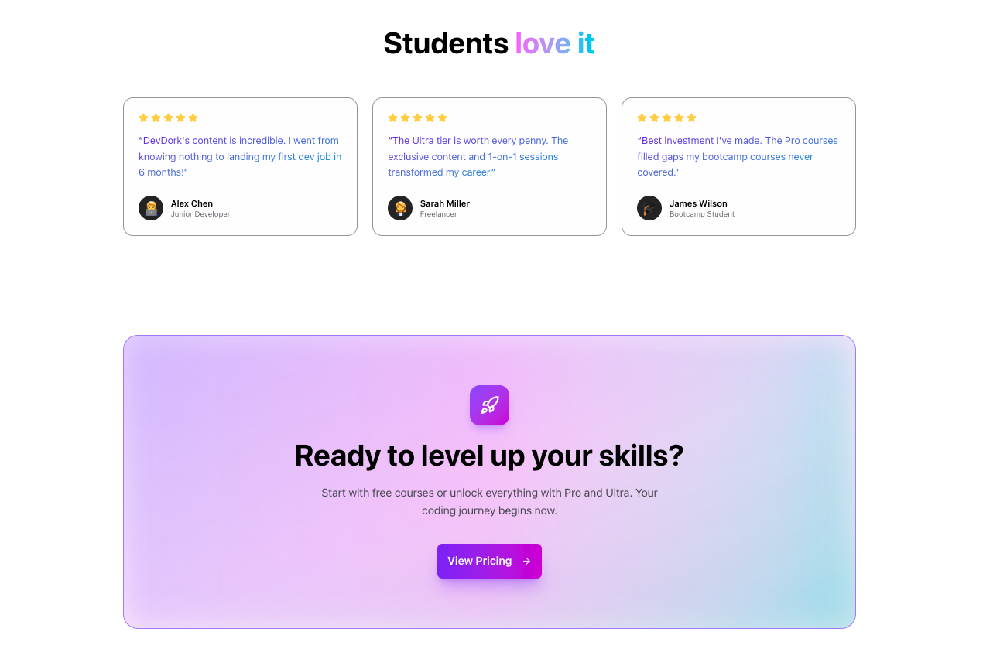
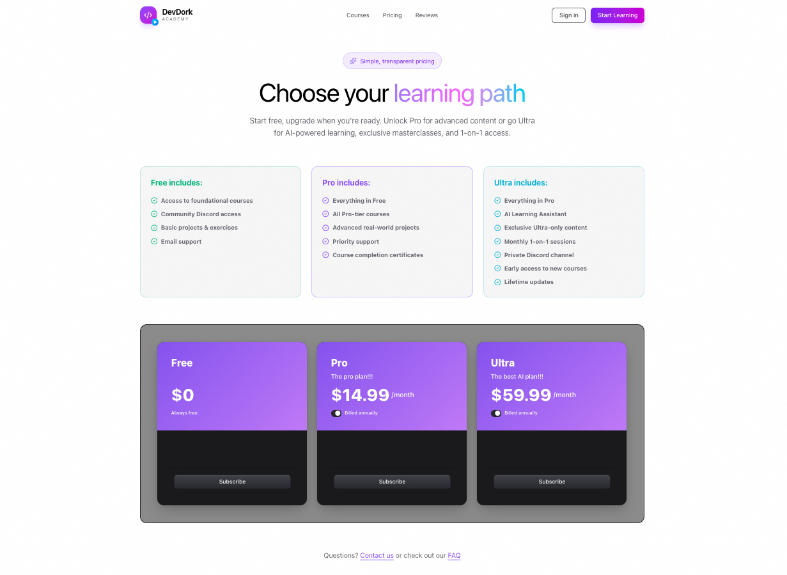
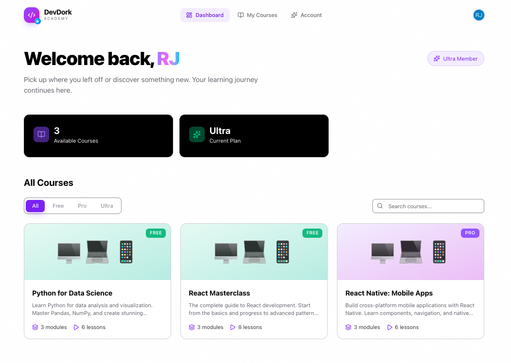
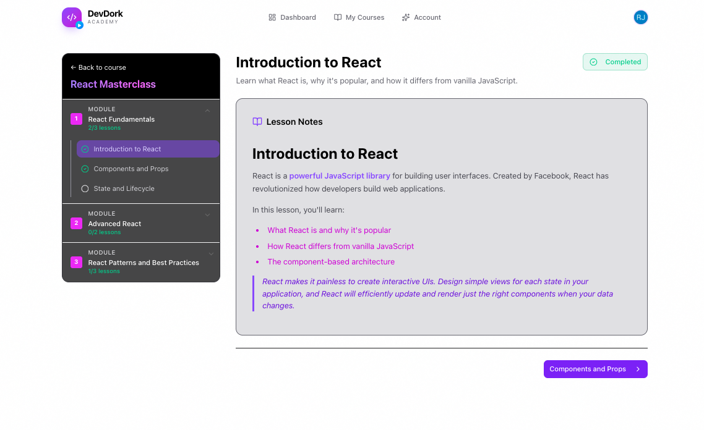
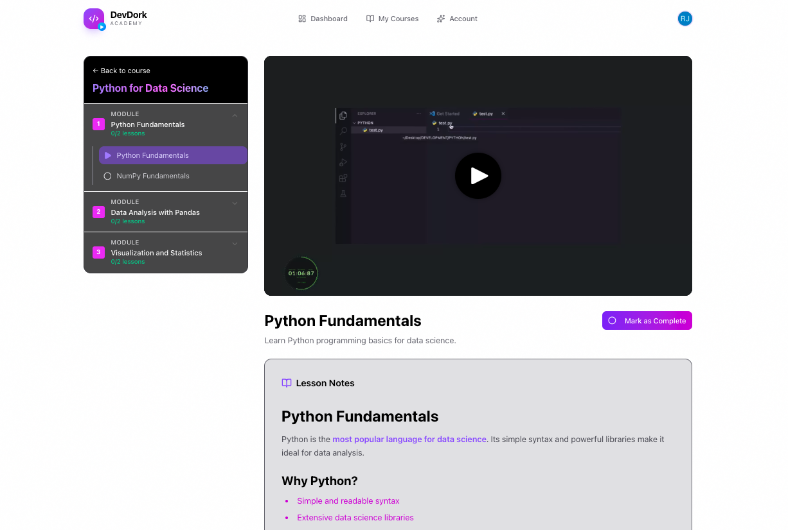

# DevDork's Academy - AI-Powered LMS Platform

[](https://creativecommons.org/licenses/by-nc/4.0/)
[](https://nextjs.org/)
[](https://react.dev/)
[](https://www.sanity.io/)
[](https://clerk.com/)
[](https://www.mux.com/)
[](https://openai.com/)
[](https://tailwindcss.com/)

---

# 📚 DevDork's Academy — AI-Powered Learning Management System

DevDork’s Academy is a **next-generation LMS SaaS platform** that blends  
**AI-powered learning**, **interactive coding**, **video-based lessons**,  
and **full authentication + payments infrastructure** into a single,  
scalable Next.js 16 application.

This platform is designed as a **modern LMS boilerplate**, complete with:

- AI Chat Tutor (GPT-4o)  
- Video lessons powered by **Mux**  
- Course management via **Sanity CMS**  
- User authentication + subscriptions via **Clerk**  
- Fully responsive UI with **Tailwind CSS v4**  
- Server Components + App Router architecture  

---

<table>
<tr>
<td width="50%" valign="top">

### ✨ What Makes This Special

- **Custom Admin Panel** built with Sanity App SDK (not just Studio!)
- **AI Learning Assistant** powered by GPT-4o
- **Tiered Subscriptions** with Clerk billing
- **Professional Video Streaming** via Mux

</td>
<td width="50%" valign="top">

### 🛠️ Technical Highlights

- Next.js 16 App Router + React 19
- Real-time content updates with Sanity SDK
- Drag-and-drop course builder
- TypeScript end-to-end with typegen
- Modern UI with Shadcn + Tailwind 4

</td>
</tr>
</table>

---

# 🖼️ Screenshots  
*(You will upload the images — I will insert filenames after you share them.)*

Ordered as requested:

### 1. 🦸 Hero Section  


### 2. ⭐ DDTestimonials  


### 3. 💵 Pricing Page  


### 4. 🔐 Clerk Authentication Flow  


### 5. 📊 Student Dashboard  


### 6. ⚛️ React Course Module  


### 7. 🐍 Python Video Lesson (Mux Player)  


---

# 🧠 Core Features

### ✨ AI-Powered Learning (OpenAI GPT-4o)
- Built-in “AI Tutor” for personalized help  
- Inline explanations, code reviews, and assignment guidance  
- Streaming responses with ChatKit/AgentKit architecture  

### 🎥 Video Lessons (Mux Player)
- High-performance video streaming  
- Secure playback, thumbnails, analytics  
- Supports MP4, HLS, and adaptive streaming  

### 🧑‍🏫 Course Management (Sanity CMS)
- Modular lessons, quizzes, and modules  
- Instant content updates via Sanity Studio  
- Custom schemas for LMS structure (course → sections → lessons)

### 🔐 Authentication + Billing (Clerk)
- Enterprise-grade user accounts  
- Magic Links, OAuth, MFA  
- Pricing tables + optional subscription gating  

### 🧭 Dashboard + Progress Tracking
- Tracks lesson completion  
- Saves quiz progress  
- AI-generated “study summaries”  

### 🚀 Modern Stack (Next.js 16 + React 19)
- App Router  
- Server Components  
- Server Actions  
- Turbopack  
- Type-safe architecture  

---

# 🛠️ Tech Stack

| Layer | Technology |
|-------|------------|
| Frontend | Next.js 16, React 19, Tailwind CSS v4 |
| CMS | Sanity CMS + Presentation Mode |
| Auth | Clerk |
| Video | Mux Player + Upload API |
| AI | OpenAI GPT-4o, ChatKit, AgentKit |
| Storage | Vercel Blob / S3 (optional) |
| Deployment | Vercel |

---

# 📁 Project Structure (Simplified)

```plaintext
lms-ai-saas/
│
├── app/
│   ├── (marketing)/        # Public pages
│   ├── (dashboard)/        # Authenticated LMS
│   ├── api/                # Webhooks, actions
│   └── pricing/            # Clerk Pricing Table
│
├── components/
│   ├── ui/                 # Tailwind UI components
│   ├── video/              # Mux player UI
│   └── ai/                 # AI Tutor chat components
│
├── sanity/
│   ├── schemaTypes/        # Course, lesson, quiz schemas
│   └── desk/               # Studio config
│
├── lib/
│   ├── auth/               # Clerk helpers
│   ├── ai/                 # OpenAI clients
│   └── mux/                # Video upload helpers
│
└── public/
    └── screenshots/

# ⚙️ Installation & Development
```bash
git clone https://github.com/johnsonr84/lms-ai-saas
cd lms-ai-saas
npm install
npm run dev
```

### Environment Variables

Create a `.env.local` file with the following variables:

```bash
# Sanity Configuration
NEXT_PUBLIC_SANITY_PROJECT_ID=your_project_id
NEXT_PUBLIC_SANITY_DATASET=production
NEXT_PUBLIC_SANITY_API_VERSION=2025-11-27

# Clerk Authentication
NEXT_PUBLIC_CLERK_PUBLISHABLE_KEY=pk_test_...
CLERK_SECRET_KEY=sk_test_...

# OpenAI (for AI Tutor)
OPENAI_API_KEY=sk-...

# Mux Video
MUX_TOKEN_ID=your_mux_token_id
MUX_TOKEN_SECRET=your_mux_token_secret
MUX_SIGNING_KEY_ID=your_signing_key_id
MUX_SIGNING_KEY_PRIVATE=your_signing_key_private
```


# 👨‍💻 Author
## Robert Johnson
## Full-Stack Software Engineer • DevDork Labs
### https://robertjohnsonportfolio.com
